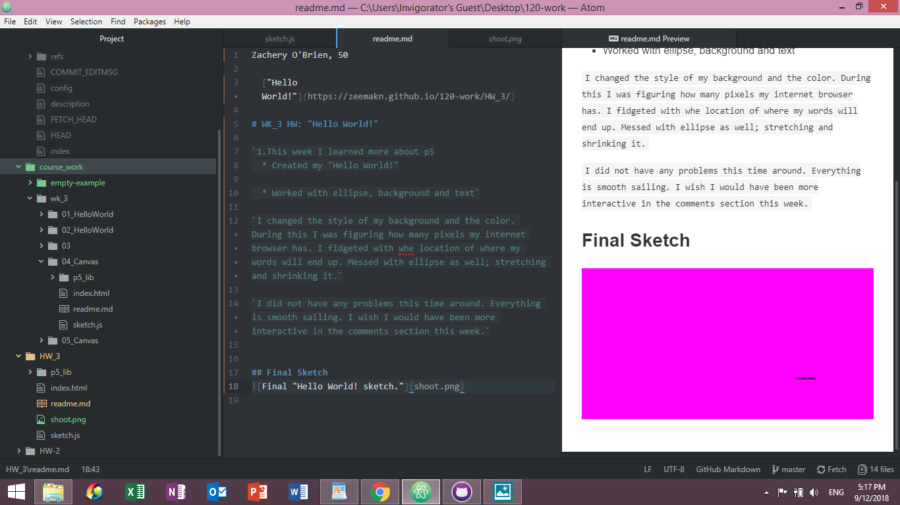

Zachery O'Brien, 50

  ["Hello World!"](https://zeemakn.github.io/120-work/HW_3/)

# WK_3 HW: "Hello World!"

`1.This week I learned more about p5
  * Created my "Hello World!"

  * Worked with ellipse, background and text`

`I changed the style of my background and the color. During this I was figuring how many pixels my internet browser has. I fidgeted with whe location of where my words will end up. Messed with ellipse as well; stretching and shrinking it.`

`I did not have any problems this time around. Everything is smooth sailing. I wish I would have been more interactive in the comments section this week.`

## Final Sketch

