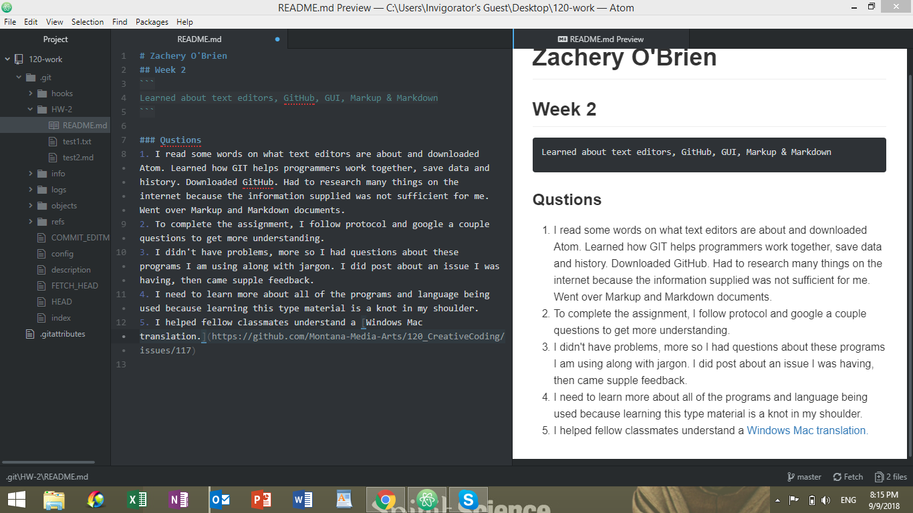

# Zachery O'Brien
## Week 2
```
Learned about text editors, GitHub, GUI, Markup & Markdown
```

### Qustions
1. I read some words on what text editors are about and downloaded Atom. Learned how GIT helps programmers work together, save data and history. Downloaded GitHub. Had to research many things on the internet because the information supplied was not sufficient for me. Went over Markup and Markdown documents.  
2. To complete the assignment, I follow protocol and google a couple questions to get more understanding.
3. I didn't have problems, more so I had questions about these programs I am using along with jargon. I did post about an issue I was having, then came supple feedback.
4. I need to learn more about all of the programs and language being used because learning this type material is a knot in my shoulder.
5. I helped fellow classmates understand a [Windows Mac translation.](https://github.com/Montana-Media-Arts/120_CreativeCoding/issues/117)



